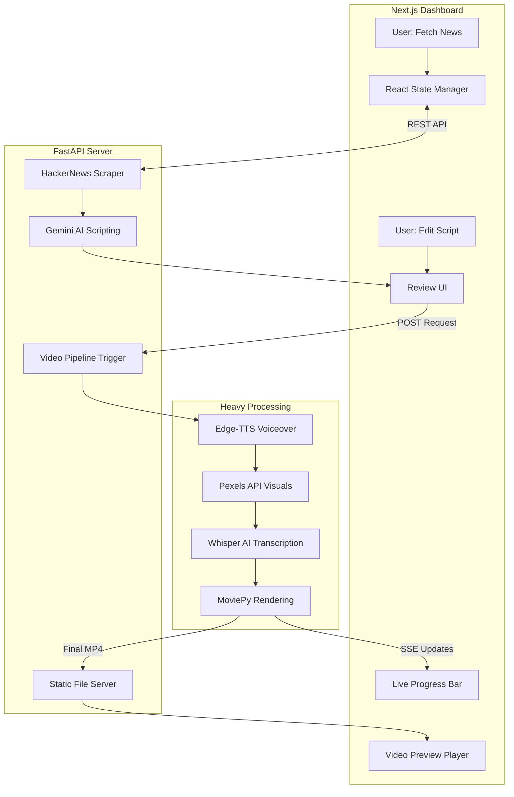

# 🎬 AI Video Factory (Full-Stack)

A **Human-in-the-Loop** automated video production pipeline that transforms trending tech news into high-engagement vertical shorts.

---

## 🏗️ System Architecture

🔬 The "Human-in-the-Loop" Design Philosophy
Fully automated AI video production often suffers from "hallucinated" facts or poor pacing. I designed this system to solve the Trust Gap in Generative AI. By inserting a human-centric review stage between script generation and final rendering, the user maintains 100% editorial control while the AI handles 90% of the manual labor.

⚡ Technical Highlights
Asynchronous Processing: Utilizes FastAPI BackgroundTasks to ensure the user interface remains responsive while the server handles heavy media synthesis.

Zero-Cost Captions: Integrates OpenAI’s Whisper locally to generate precise, word-level timestamps without relying on expensive third-party APIs.

SSE State Management: Provides real-time feedback via Server-Sent Events (SSE), ensuring the user is constantly informed of the rendering status.

Decoupled Architecture: Separates the Python media engine from the React-based management dashboard for better scalability and maintenance.

---

## 📸 Interface Preview

### 1. Home (News-to-Script Transition)

*Showing the data ingestion and Gemini transformation.*

### 2. Rendering Pulse

*Capturing the live progress bar and terminal activity.*

### 3. Mobile Preview

*The final vertical video served through the local static file server.*

---
🛠️ Installation & Setup
Backend (FastAPI)
Bash
# From root directory
python -m uvicorn server:app --reload --reload-dir .
Frontend (Next.js)
Bash
# From frontend directory
cd frontend
npm run dev
Alex Gurung | Graduate Student @ University of Michigan-Flint

Expected Graduation: April 30, 2026