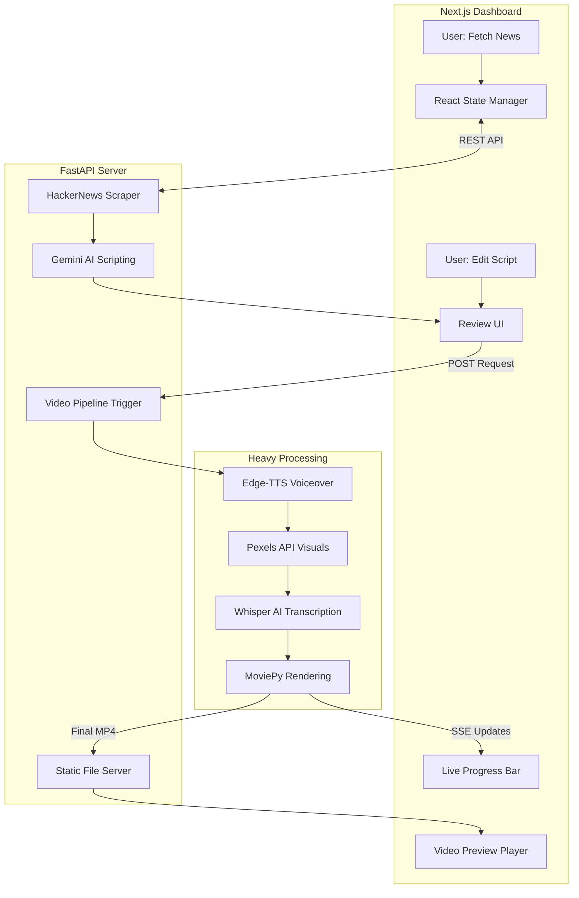
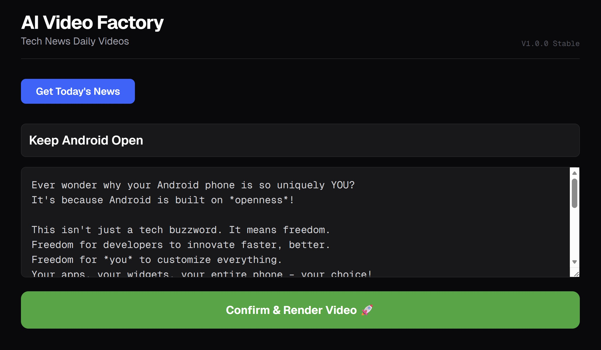
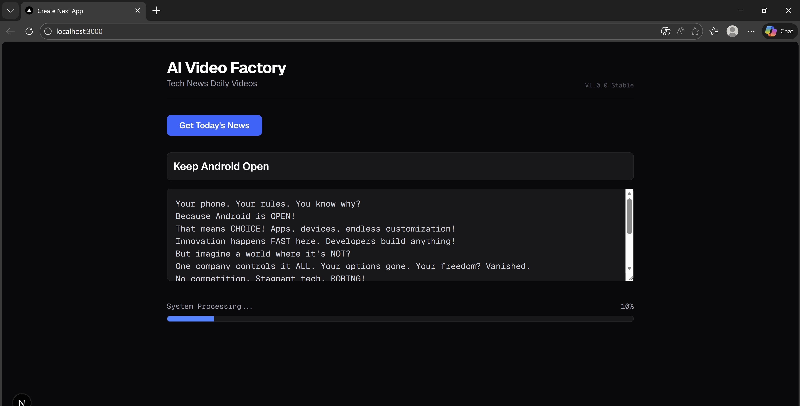
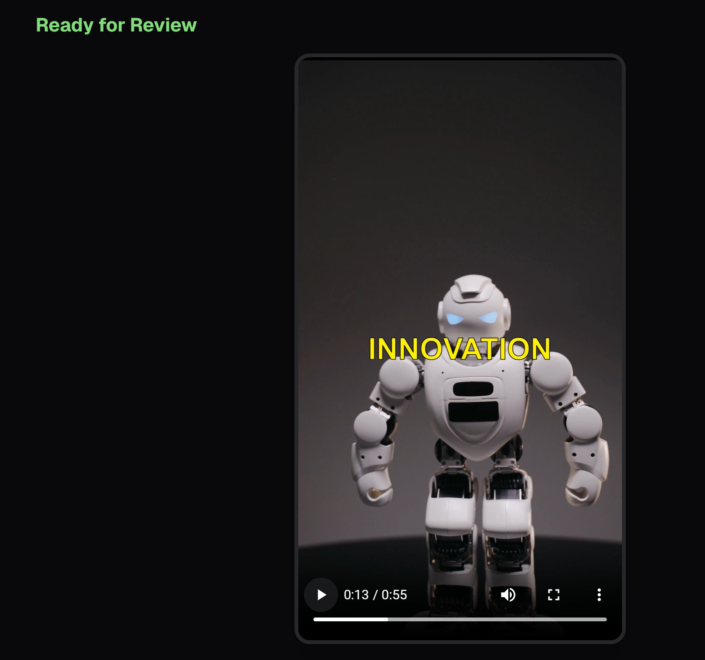

# 🎬 AI Video Factory  
### Human-in-the-Loop AI System for Automated Short-Form Tech News Videos

AI Video Factory is a **full-stack, human-supervised video production pipeline** that transforms trending tech news into high-engagement vertical short videos.

Instead of fully automating content creation (and risking AI hallucinations or weak storytelling), this system strategically inserts a **human editorial checkpoint** — ensuring factual accuracy, narrative quality, and pacing — while AI handles the heavy lifting.

⚡ **90% automation**  
🧠 **100% editorial control**

---
graph LR
    Start((Trending News)) --> Trigger[HackerNews Scraper]
    
    subgraph Agent_Brain [AI Agent: Gemini 1.5 Pro]
        Reasoning{Reasoning Loop}
        Script[Generate Script]
        Structure[Define Visual Cues]
    end

    Trigger --> Reasoning
    Reasoning --> Script
    Script --> Structure

    subgraph Tool_Kit [Agent Tool Use]
        Voice[Edge-TTS: Vocalize]
        Search[Pexels API: Visual Retrieval]
        Transcribe[Whisper AI: Time-Sync]
        Render[MoviePy: Assembler]
    end

    Structure --> Tool_Kit
    Tool_Kit --> Review{User Review}
    Review -- "Edits" --> Reasoning
    Review -- "Approved" --> Final((Final Video))

---


## 🚀 What This Project Does

- Scrapes trending tech news (Hacker News)
- Uses Gemini to generate a short-form script
- Allows the user to review/edit the script
- Automatically generates:
  - AI voiceover
  - Stock visuals
  - Captions with word-level timestamps
  - Vertical video rendering
- Streams live rendering progress to the UI
- Serves the final MP4 for preview and download

All within a clean Next.js dashboard.

---



## 🧠 The Human-in-the-Loop Philosophy

Fully automated AI content pipelines often fail in subtle but critical ways:

- Hallucinated facts
- Weak narrative hooks
- Poor pacing
- Generic tone

This system closes the **Trust Gap in Generative AI** by inserting a structured human review stage between script generation and rendering.

Instead of replacing the creator, AI acts as a **production co-pilot**.

### The Result:

- Faster workflow
- Higher content quality
- Editorial oversight
- Scalable video generation

This architecture reflects real-world AI product design — not just experimentation.

---

## ⚡ Technical Highlights

### 🔄 Asynchronous Media Processing

- Uses `FastAPI BackgroundTasks` to handle heavy rendering without blocking the UI.
- The frontend remains fully responsive during voice synthesis, transcription, and video generation.

---

### 🗣️ Zero-Cost Captions (Local Whisper)

- Integrates OpenAI Whisper locally to generate accurate, word-level timestamps.
- No reliance on expensive third-party caption APIs.

Benefits:
- No per-minute billing
- Full control
- Higher precision alignment

---

### 📡 Real-Time State Streaming (SSE)

- Implements Server-Sent Events (SSE) to stream live rendering progress to the dashboard.

Users see:
- Pipeline stage updates
- Processing logs
- Completion status

No polling. No guesswork.

---

### 🧩 Decoupled Architecture

The system separates:

- 🎨 React-based dashboard (UI/UX layer)
- ⚙️ FastAPI orchestration layer
- 🎬 Python media engine (heavy processing)

This improves:
- Maintainability
- Scalability
- Clear separation of concerns

---

## 📸 Interface Preview

### 📰 1. News → Script Generation

Shows trending stories fetched and transformed via Gemini into short-form scripts.

### ⏳ 2. Rendering Pulse

Live progress bar powered by SSE — reflecting backend pipeline stages in real time.

### 📱 3. Vertical Mobile Preview

Final MP4 served through a local static file server and displayed in a mobile-style player.

---

## 🛠️ Installation & Setup

### 🔹 Backend (FastAPI)

From the root directory:

```bash
python -m uvicorn server:app --reload --reload-dir .
```

### 🔹 Frontend (Next.js)

```bash
cd frontend
npm install
npm run dev
```

---

## 🧪 Tech Stack

### Frontend
- Next.js
- React
- Tailwind (if applicable)
- Server-Sent Events

### Backend
- FastAPI
- Python AsyncIO

### AI & Media
- Gemini (Script Generation)
- Edge-TTS (Voiceover)
- Whisper (Local Transcription)
- Pexels API (Visual Assets)
- MoviePy (Video Rendering)

---

## 🎯 Why This Project Matters

Short-form content dominates digital media.  
AI makes content generation scalable — but trust, pacing, and narrative quality still require human oversight.

AI Video Factory demonstrates:

- Applied AI product thinking
- Full-stack system design
- Media automation engineering
- Human-centered AI architecture
- Real-time distributed state management

It is not just a demo — it is a blueprint for production-grade AI media systems.

---

## 👨‍💻 Author

**Alex Gurung**  
